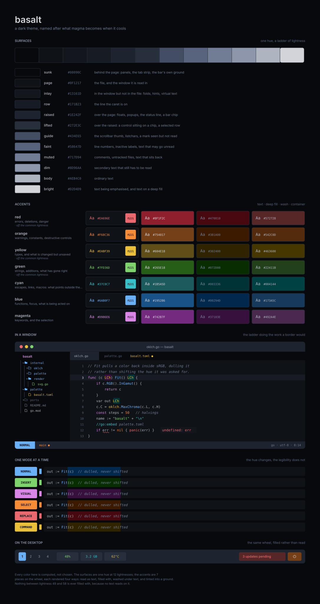

# basalt

A dark theme, named after what magma becomes when it cools. Reading this should
tell you what the theme is, how the palette is put together, and how a port gets
its colors.

## The palette

The theme's palette lives in `palette/` and is the only place where colors are
chosen. Every target reads from it through a generator, so a theme for an
editor, a terminal or the desktop chrome is deterministic output rather than a
file kept in sync. Regenerating is one command, and a color that changes changes
everywhere, uniformly, all at once.

## The idea

There's one hue for the surfaces and a wheel of accents on top of them. The
surfaces are a ladder: the further from the page something sits, the further its
shade is from the page's. That ladder carries most of the work, which is why I
believe that very little in the theme needs a border to be legible.

Accents are not single colors but sets. Each is placed on the wheel once and
answers to five distinct functions: the value that reads as text on a dark
surface, that same value used as a fill with the deepest surface as its text, a
darker and heavily saturated version to fill with when something is serious, a
wash laid under text that already has a color of its own, and a tinted ground
with ordinary text on it. Only four of those are stored, since the first two
are one color doing two jobs. So a color means the same thing whether it is a
keyword, a mode block or an urgent chip.

The two grounds differ by whether you look at them or through them. A container
is the strip, and it is seen. A wash lies under a selection and has to leave
what it covers readable, so it is seen through. Those pull opposite ways, which
is why one value cannot be both.

Which of the four is used is what separates the editor from the desktop. A file
is nearly all text; a bar is nearly all fills. The wheel does not change between
them.

## Layout

| Path               | What it holds                             |
| ------------------ | ----------------------------------------- |
| `palette/`         | Where the colors are decided              |
| `basalt.json`      | The resolved palette, for other repos     |
| `cmd/`             | The generator                             |
| `internal/`        | Color math, the export and the sheet      |
| `assets/`          | The sheet above, drawn from the palette   |
| `.github/scripts/` | Drawing the sheet, and cutting a release  |

Neither the sheet nor the export is written by hand.
`.github/scripts/screenshot` redraws both from `palette/basalt.toml`, and CI
fails if what is committed is not what the palette produces.

## Using it

basalt does not generate anyone's theme. It publishes `basalt.json`, and each
project maps those colors onto its own names, because which entry a role takes
is a statement about the thing being themed rather than about the color. A
Neovim highlight group and a status bar chip have nothing to say to each other,
and a generator here would have had to learn both.

One thing a port should not decide for itself is a terminal's bright half, as it
is the same as the normal half. An accent is one color, and the palette has no
second text weight to give a bright slot, so only the four greys differ between
the two halves. `palette/basalt.toml` says why.

The export carries every entry as a hex and as the position it was computed
from, so anything that needs to composite or derive a state can do the
arithmetic without first undoing the conversion. Surfaces come in ladder order,
deepest first, and that order is meaningful.
